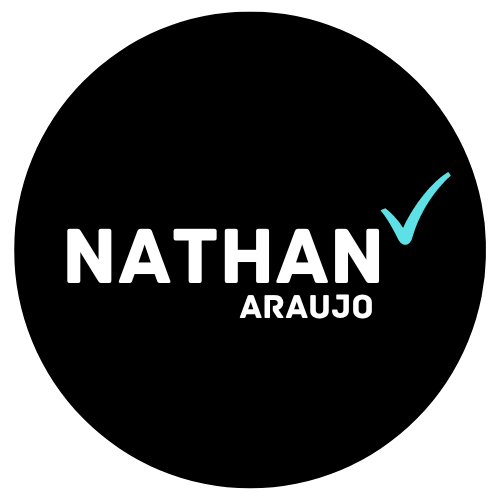

# thecollege.ms-travel-easy

The primary objective of this project is to learn and practice using Git commands while developing/testing.

## Learning Objectives

This project serves as a practical learning ground for understanding Git commands and their role in collaborative software development. By working on this project, you'll gain hands-on experience with:

- **Repository Management:** Creating, cloning, and managing Git repositories for version control.
- **Branching Strategies:** Working with branches, understanding branch structure, and utilizing branching strategies like feature branches.
- **Committing Changes:** Making commits, writing descriptive commit messages, and understanding the importance of version history.
- **Merging and Resolving Conflicts:** Merging changes between branches and resolving merge conflicts.
- **Collaborative Workflow:** Practicing pull requests, code reviews, and collaborating with team members.

# Travel Easy API

This project provides an API to manage customer accounts so far as it serves the purpose mentioned above

## Setup Instructions

### Prerequisites

Ensure you have the following installed:

- [.NET SDK](https://dotnet.microsoft.com/download)
- [Visual Studio](https://visualstudio.microsoft.com/downloads/)

### .NET SDK Installation

1. **Download .NET SDK:**

   - Visit the [.NET SDK Downloads](https://dotnet.microsoft.com/download) page.
   - Download and install the appropriate SDK for your operating system.
   - Follow the on-screen instructions to complete the installation.

### Install MongoDB Compass or Robo 3T

1. **Download MongoDB Compass or Robo 3T:**

   - Visit the [MongoDB Compass](https://www.mongodb.com/products/compass) or [Robo 3T](https://robomongo.org/download) download page.
   - Download the appropriate version for your operating system.
   - Follow the installation guide for your OS provided on the download page.

   > MongoDB Compass and Robo 3T are graphical user interfaces (GUIs) for MongoDB. They provide visual tools to interact with MongoDB databases, offering functionalities such as exploring data, running queries, and managing databases and collections.

2. **Connect to MongoDB:**

   - Open MongoDB Compass or Robo 3T after installation.
   - Connect to your local MongoDB instance by providing the connection details. (See the connection string in `appsettings.json`)
   - Explore databases and collections, and perform various operations using the GUI.

### Visual Studio Installation

1. **Download Visual Studio:**

   - Visit the [Visual Studio Downloads](https://visualstudio.microsoft.com/downloads/) page.
   - Select the edition of Visual Studio you prefer (Community, Professional, or Enterprise) and click "Download".
   - Follow the on-screen instructions to complete the download.

2. **Run the Installer:**

   - Once the download is complete, run the installer.
   - Choose the components you want to install. For .NET development, ensure the ".NET desktop development" workload is selected.
   - Include ASP.NET and web development-related components during installation.

### Build and Run Locally

1. **Clone the repository:**

   ```bash
   git clone https://github.com/araujosnathan/thecollege.ms-travel-easy.git

   cd ms-travel-easy

   dotnet build

   dotnet run ms-travel-easy.csproj
   ```

## API Endpoints

- **Swagger:** http://localhost:5086/swagger/index.html

### GET /api/v1/Customer/Accounts

- **Description:** Retrieve all customer accounts.
- **Usage:**
  - Send a GET request to `http://localhost:5086/api/v1/Customer/Accounts`.

### GET /api/v1/Customer/Accounts/{email}

- **Description:** Retrieve a customer account by email.
- **Usage:**
  - Send a GET request to `http://localhost:5086/api/v1/Customer/Accounts/{email}`.
  - Replace `{email}` with the customer's email.

### POST /api/v1/Customer/Accounts

- **Description:** Create a new customer account.
- **Usage:**
  - Send a POST request to `http://localhost:5086/api/v1/Customer/Accounts`.
  - Provide a JSON body with the following fields: `Name`, `LastName`, `Email`, `PhoneNumber`.
